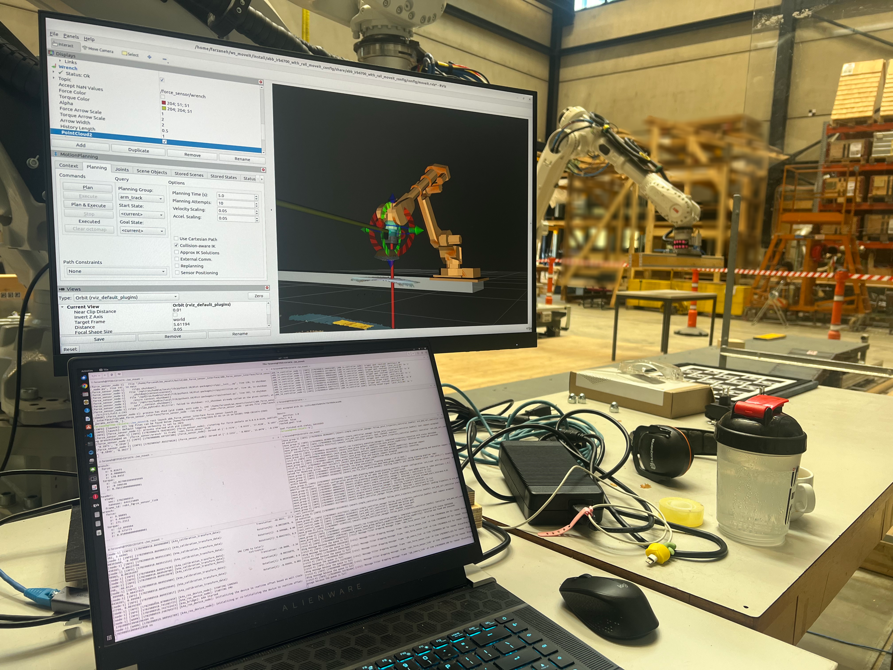

# EPFL GIS Robotics Cell
[](https://doi.org/10.5281/zenodo.21778874)


*ABB IRB6700 with eye-in-hand perception and force sensing — live RViz scene and force sensor stream.*


ROS2 packages for the EPFL GIS multi-robot cell: motion control, end-effector
descriptions, force sensing, digital I/O, and eye-in-hand perception for an
ABB IRB6700 on a linear rail with a Schunk SWS-160 tool changer.

Robot: ABB IRB6700 175/3.05 on IRBT6004 7m rail\
Author: Farzaneh Eskandari\
Email: farzane.eskandarii@gmail.com / farzaneh.eskandari@epfl.ch


## Packages

### `abb_io_controller`
ROS2 digital I/O control via ABB RWS (Robot Web Services). Provides services and
actions for the Schunk SWS-160 tool changer (lock/unlock) and the Joulin
PP-PG-160x600 vacuum gripper. See the package [README](abb_io_controller/README.md).

### `robot_end_effectors`
URDF/xacro descriptions for end effectors:
- **`joulin_vacuum_gripper`** — Joulin PP-PG-160x600 vacuum gripper.
- **`schunk_tool_changer`** — Schunk SWS-160 automatic tool changer (SWK-160
  robot side + SWA-160 tool side), including the `tcp_straight` frame that
  cancels the changer's mounting clocking.

### `robot_force_sensor`
Description of the ABB force sensor stack mounted between the robot flange and
the tool changer, used for force-guarded contact tasks.
- **`abb_force_sensor_description`** — URDF/xacro for the ABB force sensor
  (large, 3HAC091307-001/02, Force Control option) plus the two flange-side
  adapter plates. Outputs the `force_adapter_mount` frame where the tool
  changer attaches. The sensor's Z axis is coaxial with the tool approach
  axis, so contact force along an approach reads directly as `wrench.force.z`.
- *(planned)* interface/driver package publishing `WrenchStamped` from the
  sensor's UDP stream.

### `robot_perception`
Perception packages for the cell (eye-in-hand):
- **`Azure-Kinect-Sensor-ROS2`** — Azure Kinect DK integration, including camera
  description, the hand-eye calibration pipeline (ChArUco detector +
  easy_handeye2), and the point-cloud bridge into the robot TF tree. Uses the
  [Azure_Kinect_ROS_Driver](https://github.com/microsoft/Azure_Kinect_ROS_Driver)
  submodule. See its [README](robot_perception/Azure-Kinect-Sensor-ROS2/abb_kinect_description/README.md)
  for build/run and [HANDEYE_CALIBRATION_INSTRUCTIONS](robot_perception/Azure-Kinect-Sensor-ROS2/abb_kinect_description/docs/HANDEYE_CALIBRATION.md)
  for calibration instructions.
- **`easy_handeye2`** — hand-eye calibration framework (submodule).
- *(planned)* ROS2 packages for the Photoneo MotionCam-3D (PhoXi) — a
  higher-accuracy structured-light scanner on the same eye-in-hand bracket,
  hand-eye calibrated into the robot TF tree.


---
## Tool chain

The full flange-to-tool kinematic chain, modeled across the description packages:

```
tool0
  -> flange adapter plate A (20mm)
  -> flange adapter plate B (15mm)
  -> ABB force sensor (62mm)
  -> tool-side adapter plate (4mm)
  -> SWK-160 tool changer (mounted with 15 deg clocking about Z)
  -> SWA-160 tool side
  -> tcp_straight (clocking cancelled; nominal-aligned TCP for all tools)
```

The Azure Kinect mounts on the SWK-160 chamfer face (eye-in-hand). Its optical
frame is defined directly from the hand-eye calibration, so perception data is
expressed in accurate robot coordinates.

---

## Setup

```bash
git clone --recurse-submodules git@github.com:farzanehesk/epfl_gis_robotics_cell.git
```


If already cloned without submodules:
```bash
git submodule update --init --recursive
```

Build:
```bash
cd ~/ws_moveit
colcon build
source install/setup.bash
```


## Future Development

- [ ] Force/torque interface package (read sensor data into ROS2 as `WrenchStamped`)
- [ ] ROS2 packages for the Photoneo MotionCam-3D (PhoXi) eye-in-hand scanner
- [ ] Per-tool TCP definitions below `tcp_straight` (vacuum gripper, sharp tools)
- [ ] Additional end effectors / tool descriptions
- [ ] Full two-robot synchronized system (two IRB6700s, two rails, spindle)
