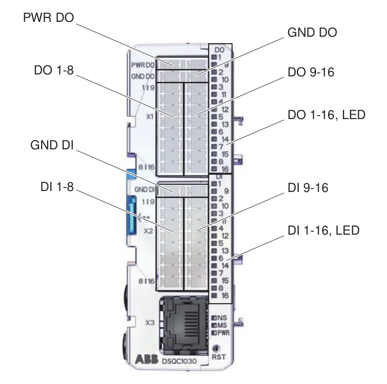
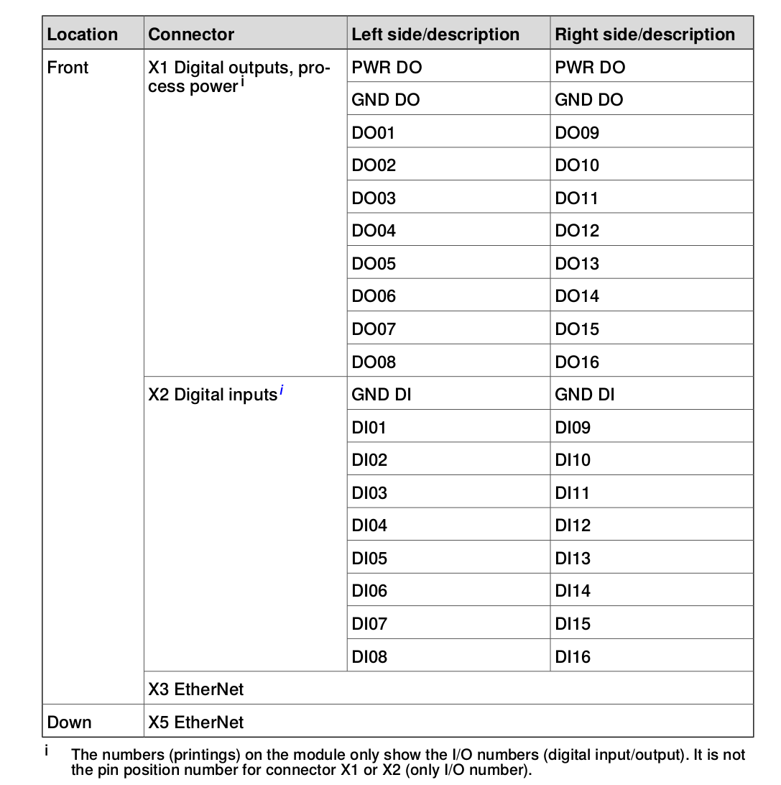
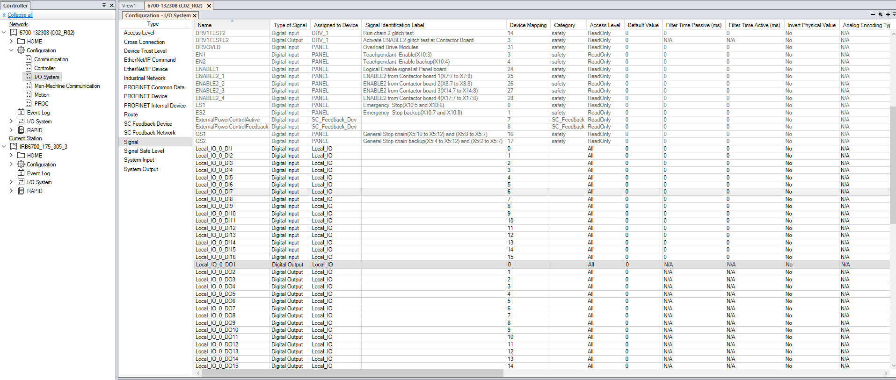

# abb_io_controller

ROS2 package for controlling digital I/O signals on the ABB IRC5 controller via RWS (Robot Web Services) — used for the Schunk SWS-160 tool changer and the Joulin PP-PG-160x600 vacuum gripper.

**Robot:** ABB IRB6700 175/3.05 on IRBT6004 7m rail\
**Author:** Farzaneh Eskandari (farzane.eskandarii@gmail.com)

---

## Overview

This package exposes ROS2 services and an action server that write to the IRC5's `Local_IO` digital I/O module (ABB **DSQC1030** Scalable I/O base device) via RWS.

It uses `RWSManager::runPriorityService()` to call `RWSStateMachineInterface::setIOSignal(name, value)`.

---

## Hardware reference

I/O module: **ABB DSQC1030** (Digital base device, 16 DI / 16 DO)

Official manual:
[ABB Scalable I/O – Application Manual (3HAC070208-001)](https://search.abb.com/library/Download.aspx?DocumentID=3HAC070208-001&LanguageCode=en&DocumentPartId=&Action=Launch)


 &nbsp;&nbsp;&nbsp;&nbsp;

---

## Interfaces

| Interface | Type | Description |
|---|---|---|
| `/tool_changer/lock` | `std_srvs/srv/Trigger` | Locks SWS-160 tool changer (DO9=0) |
| `/tool_changer/unlock` | `std_srvs/srv/Trigger` | Unlocks/releases SWS-160 tool changer (DO9=1) |
| `/gripper/gripper_cmd` | `control_msgs/action/GripperCommand` | `position > 0.5` → vacuum ON (grip); `position ≤ 0.5` → vacuum OFF (release) |

---


## Confirmed I/O signal mapping

| Signal | RWS name | Function | Polarity |
|---|---|---|---|
| DO1 | `Local_IO_0_DO1` | Vacuum gripper air supply | `1` = air on (grip), `0` = off (release) |
| DO9 | `Local_IO_0_DO9` | SWS-160 tool changer | `1` = release/unlock, `0` = locked |

Mapping verified on-site (2026-06-11) on the IRC5 controller at `192.168.0.20`, `Local_IO` EtherNetIP module (DSQC1030).

## Operational Requirements

### Controller mode
RWS I/O writes work in **both MANUAL and AUTO mode**, provided the signal access level is correctly configured (see Known Issues below).

### Signal access level — CRITICAL
IRC5 signals may have access level set to **"Default"**, which blocks external RWS writes even with correct credentials and AUTO mode. The access level must be set to **"All"** for each signal used by this package.

**How to fix in RobotStudio:**
1. Connect RobotStudio to the controller
2. Go to **Controller → Configuration → I/O System → Signal**
3. For each signal (`Local_IO_0_DO1`, `Local_IO_0_DO9`):
   - Double-click the signal
   - Set **Access Level** to `All`
   - Apply and save
4. Restart the controller

See `images/3.png` for a screenshot of the correct configuration.



### Session initialization
`collectAndParseSystemData("rob1_")` must be called before any write operations to properly initialize the RWS session. This is handled automatically by the launch file.

### Credentials
RWS credentials are loaded from `config/rws_credentials.yaml` (gitignored). Copy the template and fill in your credentials:

```bash
cp config/rws_credentials.yaml.template config/rws_credentials.yaml
# Edit config/rws_credentials.yaml with your credentials
```

---

## Build & Run

```bash
# Setup network (required before connecting to robot)
sudo ip addr add 192.168.0.100/24 dev enx6c1ff704db5e

# Build
cd ~/ws_moveit
colcon build --packages-select abb_io_controller
source install/setup.bash

# Run via launch file (reads credentials from config/rws_credentials.yaml)
ros2 launch abb_io_controller io_controller.launch.py
```

---

## Test commands

```bash
# Vacuum gripper: grip
ros2 action send_goal /gripper/gripper_cmd control_msgs/action/GripperCommand "{command: {position: 1.0, max_effort: 0.0}}"

# Vacuum gripper: release
ros2 action send_goal /gripper/gripper_cmd control_msgs/action/GripperCommand "{command: {position: 0.0, max_effort: 0.0}}"

# Tool changer: unlock
ros2 service call /tool_changer/unlock std_srvs/srv/Trigger

# Tool changer: lock
ros2 service call /tool_changer/lock std_srvs/srv/Trigger
```

⚠️ **Safety:** Before toggling the tool changer, ensure no tool is attached or that it is properly supported — unlocking will release the SWA-160 adapter.

---

## Known Issues & Debugging

### RWS write returns HTTP 403 `-1073445881`
Most likely cause: signal **Access Level** is set to `Default` instead of `All`.  
Fix: see Signal access level section above.

Previously suspected causes that were ruled out:
- Controller mode (MANUAL vs AUTO) — not the cause once access level is correct
- RWS mastership — no `iosystem` mastership domain exists on IRC5
- User permissions — Admin UAS grants include "IO write access" by default
- EtherNetIP device offline — `Local_IO` device was confirmed enabled and running

### Read a signal manually via curl
```bash
curl -s --digest -u "Default User:robotics" \
  "http://192.168.0.20/rw/iosystem/signals/EtherNetIP/Local_IO/Local_IO_0_DO1" \
  -H "Accept: application/xhtml+xml" | grep lvalue
```

### Write a signal manually via curl (requires Access Level = All)
```bash
curl -s --digest -u "Admin:PASSWORD" \
  "http://192.168.0.20/rw/iosystem/signals/Local_IO_0_DO1?action=set" \
  -H "Content-Type: application/x-www-form-urlencoded" \
  --data "lvalue=1" \
  -w "\nHTTP_STATUS: %{http_code}\n"
```
Expected response: `HTTP_STATUS: 204` (success, no content).

---

## TODO — Additional DO documentation

- [ ] Document remaining unused DOs (DO2-DO8, DO10-DO16) and DIs (DI1-DI16) — physical wiring status, candidate functions
- [ ] Add DI feedback signals if available (e.g. tool changer "locked" sensor, vacuum "part present" sensor)
- [ ] Document terminal block layout (X1 connector, DSQC1030): position 1=PWR DO, position 2=GND DO, positions 3-10 = DO01-DO08 (left column) / DO09-DO16 (right column)
- [ ] Add wiring diagram / photos of the physical I/O cabinet for reference