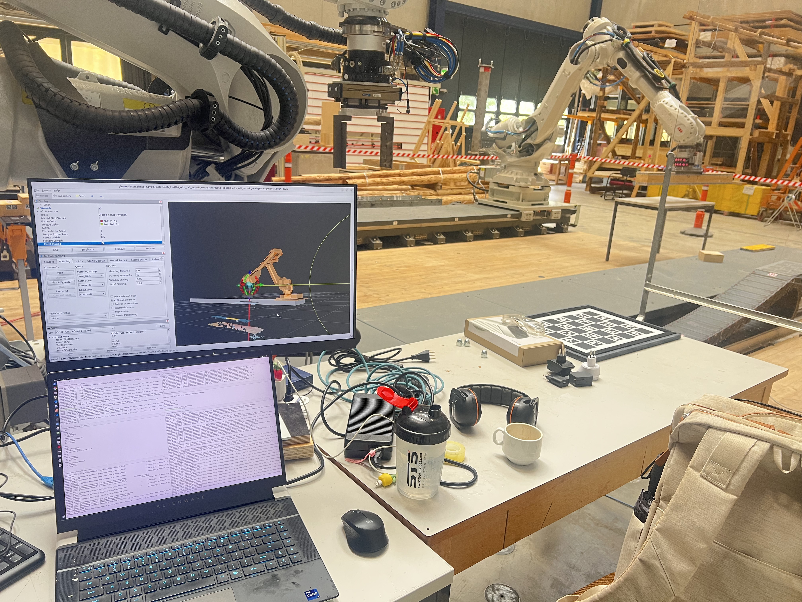

# robot_force_sensor

ABB large force sensor (Force Control Package) integration for the EPFL GIS
robotics cell (IRB 6700 on IRC5). Provides a URDF model of the sensor stack, the
RobotStudio/RAPID code that calibrates the sensor and streams force/torque over
UDP, and a ROS2 node that publishes `geometry_msgs/WrenchStamped`.

The complete data path:

```
IRC5 (RAPID, T_FORCE)                         Workstation (ROS2)
FCGetForce(\ContactForce)  ── UDP 6520 ──►    force_sensor_node
sensor-frame F/T, 6-axis                      publishes WrenchStamped
~97 Hz                                         frame: rob1_force_sensor_link
```

Validated end-to-end: a ~1 kg load hung on the gripper reads ~11.6 N cleanly on
the sensor Z axis, stable, with a consistent offset torque — physically correct.


---

## Package layout

```
robot_force_sensor/
├── abb_force_sensor_description/     URDF/xacro model of the sensor stack
│   └── urdf/abb_force_sensor.urdf.xacro
├── abb_force_sensor_interface/       ROS2 node: UDP -> WrenchStamped
│   ├── abb_force_sensor_interface/force_sensor_node.py
│   └── launch/force_sensor.launch.py
├── robot_studio_resources/           RAPID modules (load onto the IRC5)
│   ├── FCSensorCalib.mod             calibration (full + quick)
│   ├── FCSensorRead.mod              live-read for push/load testing
│   └── FCSensorStream.mod            UDP streaming background task
└── docs/
```

---

## Hardware

- **Sensor:** ABB large force sensor, 6-axis (force + torque). Barcode
  `3HAC091307-001/02`; product reference `3HAC048736-001`.
- **Robot:** IRB 6700 (large sensor → double adapter unit, type F/G; thicknesses
  measured directly so the type letter is not needed for the model).
- **License:** Force Control `661-2` active (RobotWare 6.14).
- **Tool side:** Schunk SWK-160 / SWA-160 tool changer + Joulin
  PP-PG-160x600-P20-2STX4 vacuum gripper + Azure Kinect (eye-in-hand).
- **Manuals:** Application manual - 

### Mechanical stack (measured with calipers)

| Element | Thickness | Notes |
|---|---|---|
| `tool0` | — | robot flange |
| Flange adapter plate A | 20 mm | bolts to flange |
| Flange adapter plate B | 15 mm | between plate A and sensor |
| ABB force sensor body | 62 mm | 6-axis F/T |
| Tool-side adapter plate | 4 mm | sensor → tool changer |
| SWK-160 tool changer | — | mounts on `force_adapter_mount` |

Flange → sensor: **97 mm** (20+15+62). Flange → tool-side mount: **101 mm**.

---

## URDF model (`abb_force_sensor_description`)

The `abb_force_sensor` xacro macro builds the stack as fixed joints:

```
tool0
  → flange_plate_a_link   (20 mm)
  → flange_plate_b_link   (15 mm)
  → force_sensor_link     (62 mm)   ← F/T frame; wrench is published here
  → force_adapter_link    (4 mm)
  → force_adapter_mount             ← SWK-160 attaches here
```

- Plate thicknesses parameterized; edit defaults if re-measured.
- Tool-changer **clocking (15° about Z)** modeled on `adapter_to_mount`, kept in
  sync with the −15° cancellation (`tcp_straight`) in `sws_160.urdf.xacro`. The
  clocking is downstream of `force_sensor_link`, so it does NOT affect the raw
  wrench published in that frame.

Verify after build: `ros2 run tf2_ros tf2_echo rob1_tool0 rob1_force_adapter_mount`
→ Z ≈ 0.101.


---

## Controller configuration (IRC5)

Force control is configured under `Configuration → Motion` (types `FC Sensor`,
`FC Master`, `FC Kinematics`, `FC Application`, `FC Speed Change`).

### FC Sensor instance

| Parameter | Value |
|---|---|
| Force sensor frame x / y / z | 0 / 0 / **0.097** |
| Frame quaternion (q1..q4) | 1 / 0 / 0 / 0 (identity) |
| Mount unit name | `ROB_1` |
| Force sensor type | force and torque (6-axis) |
| Noise level | 25 |

- **Frame Z = 0.097** (corrected from a stale default of 0.05). Per Application
  manual 9.3.5, Force Sensor Frame z is the distance from the flange (`tool0`) to
  the sensor coordinate system = thickness of sensor including flange-side adapters
  = 20+15+62. Validated by `FCLoadID`: `loadErr` came out ~0.005 (<<0.1), confirming
  the geometry. A config change here needs a controller restart.
- **Identity quaternion** → controller resolves F/T in flange-aligned axes; the
  URDF `force_sensor_link` is also flange-aligned, so no rotation correction is
  needed in the ROS2 node.

---

## Force data path

This is the ABB Force Control Package: **controller-mediated**. The sensor wires
into the IRC5; there is no direct socket from the sensor. F/T is read RAPID-side
with **`FCGetForce`** (Application manual 8.2.1), returning an `fcforcevector`
(`xforce..ztorque`, N / Nm).

- No transform arg → sensor coordinate system (what we publish).
- `\ContactForce` → gravity removed, contact force only. Requires calibration.
- On this controller, `FCGetForce` returns error **50323** for ANY call until
  `FCCalib` has run — calibration gates all reads, not just `\ContactForce`.

The `FORCECONTROL` / `FCASSEMBLY` / `FCMACHINING` system modules ship encoded
("Module is encoded" on the pendant is normal); their functions are callable.

---

## Calibration (RAPID: `FCSensorCalib.mod`)


## RAPID streaming task (`FCSensorStream.mod`)


### Session startup sequence (every restart)


---

## ROS2 interface (`abb_force_sensor_interface`)

`ament_python` package. `force_sensor_node` binds UDP 6520, parses one datagram per
packet, and publishes `geometry_msgs/WrenchStamped` on `/force_sensor/wrench`,
stamped in `rob1_force_sensor_link`. Drains the socket each tick (keeps up with the
stream). A `Trigger` service `~/zero` captures the current reading as a baseline
and subtracts it — handles the few-N drift / cable-coupling offset.

### Build and run

```bash
cd ~/ws_moveit
colcon build --packages-select abb_force_sensor_interface --symlink-install
source install/setup.bash

# interface up (as for EGM), if not already:
# sudo ip addr add 192.168.0.100/24 dev enx6c1ff704db5e

ros2 launch abb_force_sensor_interface force_sensor.launch.py
```

### Verify

```bash
ros2 topic echo /force_sensor/wrench          # streaming WrenchStamped
ros2 topic hz   /force_sensor/wrench          # ~97 Hz
ros2 service call /force_sensor_node/zero std_srvs/srv/Trigger   # re-zero at rest
```

Parameters (see launch file): `udp_ip`, `udp_port` (6520), `frame_id`
(`rob1_force_sensor_link`), `topic` (`/force_sensor/wrench`).

### Visualize in RViz

Launch the robot/MoveIt bringup (publishes TF + model, incl.
`rob1_force_sensor_link`), then add a **WrenchStamped** display on
`/force_sensor/wrench`, fixed frame `world`, and tune the arrow scale. The force
node runs independently of `ros2_control`, so the wrench displays even on mock
hardware (the arrow anchors to the sensor frame regardless).

---

## Validation

Zeroed unloaded, then hung a ~1 kg wood piece:

- Force ≈ **11.6 N**, almost entirely on **Z** (tool hanging down → weight along
  gravity), X/Y near zero. Magnitude matches the load (wood slightly over 1 kg).
- Torque Tx ≈ -1.65 Nm → offset load at ~14 cm lever, physically consistent.
- Stable under load (the unloaded "jumping arrow" is just the noise floor; real
  load dominates and is steady).
- Streaming sustained ~**97 Hz** (RAPID `WaitTime 0.01`, std dev ~0.6 ms).

---

