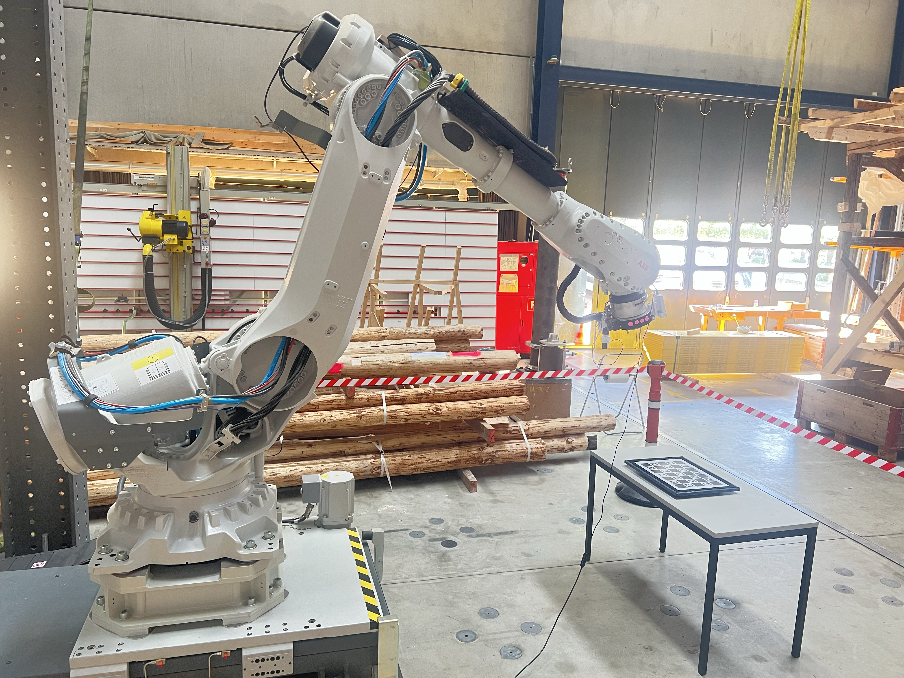
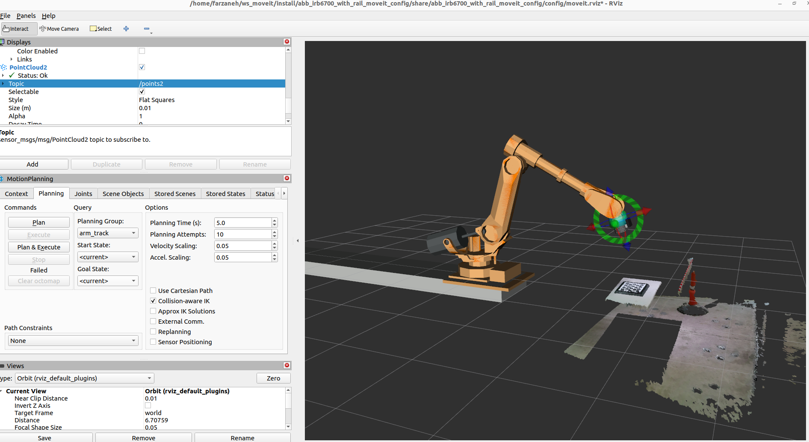

# abb_kinect_description

URDF/xacro description package for mounting the Azure Kinect DK on the ABB IRB6700 flange in eye-in-hand configuration. Provides modular macros to attach or remove the camera without modifying the robot URDF.

## Overview

| Real cell | RViz (point cloud in robot frame) |
|-----------|-----------------------------------|
|  |  |

## Tool chain

The camera is the last element of a fully modeled flange-to-tool chain:

```
tool0
  -> flange adapter plate A (20mm)
  -> flange adapter plate B (15mm)
  -> ABB force sensor (62mm)
  -> tool-side adapter plate (4mm)
  -> SWK-160 tool changer (clocked 15 deg about Z)
  -> SWA-160 tool side -> tcp_straight (clocking cancelled)
```

The Azure Kinect mounts on the SWK-160 chamfer face. Its optical frame,
`rob1_rgb_camera_optical_frame`, is defined directly from the hand-eye
calibration result (attached to `tool0`), so the point cloud and the
ChArUco detector both operate in accurate robot coordinates.

## Hand-eye calibration

For step-by-step instructions on running the eye-in-hand hand-eye calibration
(three-terminal launch, board parameters, sampling procedure, verification, and
troubleshooting), see:

➡️ [docs/HANDEYE_CALIBRATION.md](docs/HANDEYE_CALIBRATION.md)
